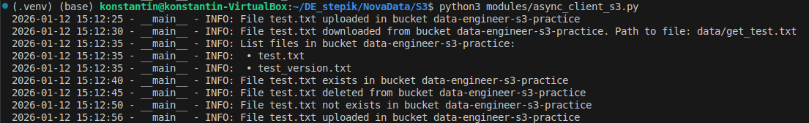
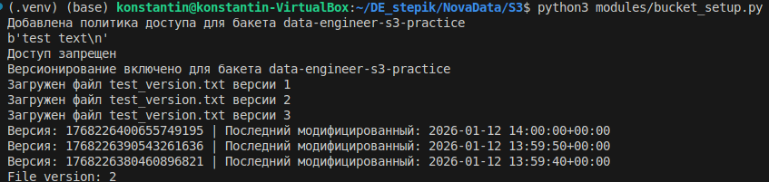
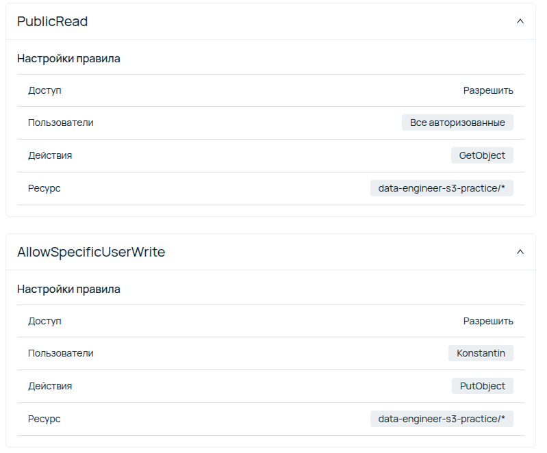
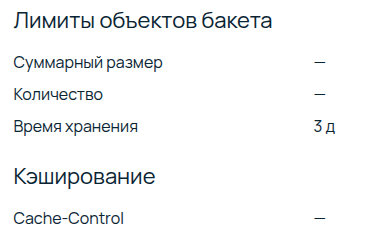
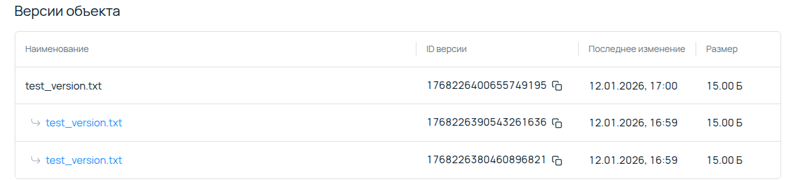
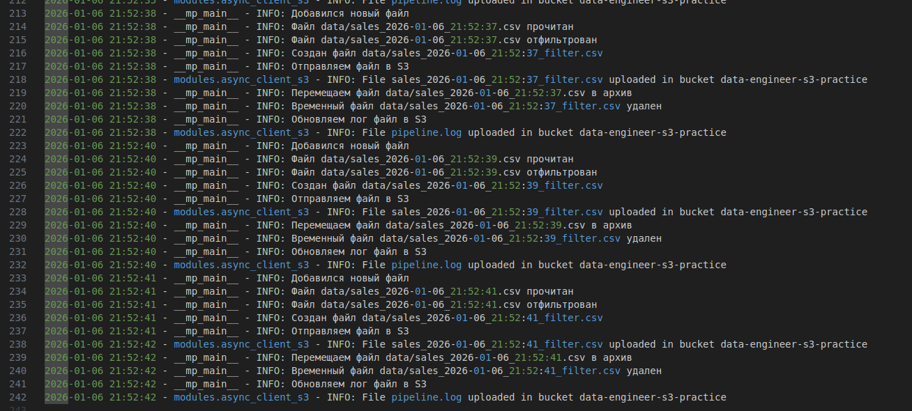
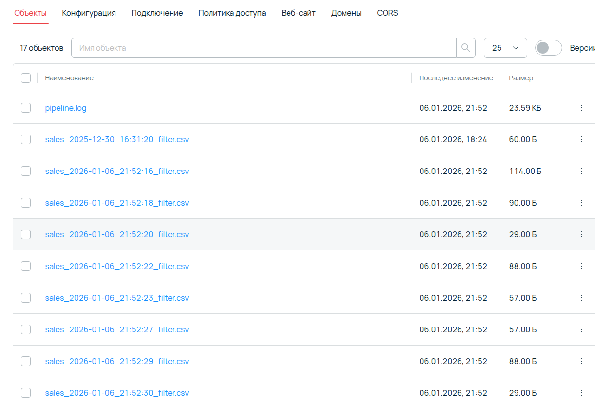

# Задание 1
* Добавьте метод list_files(), который будет возвращать список объектов в бакете.
* Добавьте метод file_exists(), который должен возвращать булевый ответ на запрос о наличии файла с определенным именем.

# Решение
* Создать файл ```.env``` и добавить в него ключи для подключения к S3,
в качестве шаблона использовать файл ```.env.example```

* Запустить [modules/async_client_s3.py](modules/async_client_s3.py "Запускает демо функцию, которая демонстрирует базовые методы")

  Запускает демо функцию, которая демонстрирует базовые методы работы с объектным хранилищем S3:
  * Загрузить файл в S3
  * Скачать файл из S3
  * Удалить файл в s3
  * Получить список объектов в S3
  * Проверка существования файла в S3

# Результат



# Задание 2

* Настройте bucket policy таким образом, чтобы:
Любой мог читать файлы из определенного бакета.
Только вы могли писать в нее.
* Включите версионирование в бакете и загрузите файл с одним именем несколько раз, а после скачайте его предыдущую версию.
* Настройте lifecycle policy таким образом, чтобы через 3 дня объекты автоматически удалялись.

# Решение 

* Запустить [modules/bucket_setup.py](modules/bucket_setup.py "Настраивает политику бакета, включает версионирование и тестирует")

  * Настраивает политику бакета, включает версионирование в бакете
  * Пробуем удалить файл
  * Тестируем версионирование

# Результат






# Задание 3

Создайте автоматизированный пайплайн, который:

1. Следит за указанной локальной папкой: используйте watchdog, watchfiles для отслеживания новых файлов. Появился новый? Запускается пайплайн. 
2. Обслуживает новые файлы с данными: читайте с pandas.DataFrame, выполняйте фильтрацию по любому из придуманных вами условий, сохраняйте во временный файл.
3. Заливает его в хранилище: асинхронно загружайте полученный файл в указанную папку бакета.
4. Перемещает обработанные файлы: либо удаляйте исходный файл, либо помещайте в архив.
5. Логирует все этапы работы:
   * Записывайте логи в отдельный файл.
   * Перезаписывайте его в хранилище (используя версионирование).

# Решение

 Запустить [modules/create_files.py](modules/create_files.py "Генерирует файлы csv")

* Скрипт генерирует файлы с данными

 Запустить [pipeline.py](pipeline.py)

# Результат



